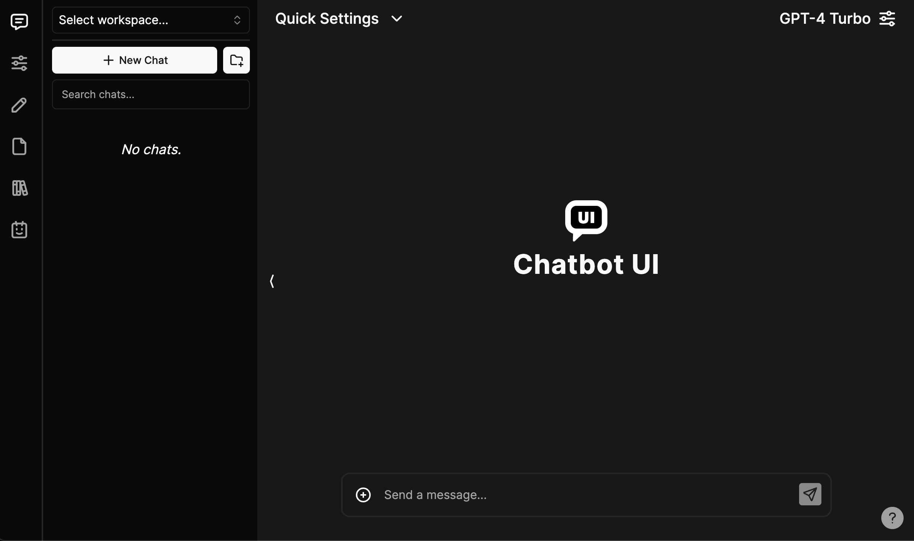

# Chatbot UI

Chatbot UI is an open-source AI chat application designed to be user-friendly and accessible for everyone.



## Demo

Check out the latest demo [here](https://x.com/mckaywrigley/status/1738273242283151777?s=20).

## Updates

I'm actively working on significant improvements based on your feedback, including simpler deployment, better backend compatibility, and enhanced mobile layouts. Stay tuned!

— Mckay

## Official Hosted Version

Don't want to host your own instance? Try the official hosted version of Chatbot UI [here](https://chatbotui.com).

## Sponsor

If Chatbot UI helps you, please consider [sponsoring](https://github.com/sponsors/mckaywrigley) my open-source efforts.

## Issues

Please limit "Issues" to problems directly related to the codebase. For general help, setup questions, or feature requests, use the "Discussions" tab instead. Unrelated issues will be closed promptly.

## Discussions

The "Discussions" tab is a great place to ask questions, share ideas, or seek help. If you have a question, chances are someone else does too.

## Legacy Code

Chatbot UI recently reached version 2.0. If you need to access the old version (1.0), visit the `legacy` branch.

## Updating

To update your local Chatbot UI instance, run:

```bash
npm run update
```

For hosted instances, also run database migrations:

```bash
npm run db-push
```

## Local Quickstart

Set up Chatbot UI locally by following these steps. You can also watch the full video guide [here](https://www.youtube.com/watch?v=9Qq3-7-HNgw).

### 1. Clone the repository

```bash
git clone https://github.com/mckaywrigley/chatbot-ui.git
```

### 2. Install dependencies

Navigate to the project directory and run:

```bash
npm install
```

### 3. Install and run Supabase

We use Supabase for secure, scalable data storage. You can find more details on why Supabase [here](https://supabase.com).

- **Install Docker:** [Docker installation](https://docs.docker.com/get-docker)
- **Install Supabase CLI:**
  - **MacOS/Linux:** `brew install supabase/tap/supabase`
  - **Windows:**
  ```bash
  scoop bucket add supabase https://github.com/supabase/scoop-bucket.git
  scoop install supabase
  ```
- **Start Supabase:**
  ```bash
  supabase start
  ```

### 4. Configure environment variables

Copy the example environment file:

```bash
cp .env.local.example .env.local
```

Retrieve Supabase details:

```bash
supabase status
```

Use these values in your `.env.local` file.

Also, update the SQL migration (`supabase/migrations/20240108234540_setup.sql`) with your `project_url` and `service_role_key`.

### 5. (Optional) Install Ollama for local models

Follow the instructions [here](https://github.com/jmorganca/ollama#macos).

### 6. Run the app

Start your local Chatbot UI instance:

```bash
npm run chat
```

Open your browser at [http://localhost:3000](http://localhost:3000). The backend GUI is available at [http://localhost:54323/project/default/editor](http://localhost:54323/project/default/editor).

## Hosted Quickstart

Follow these instructions to deploy your Chatbot UI instance to the cloud.

### 1. Local setup first

Complete the Local Quickstart steps (1-4) above. Ensure you create a separate repository for your hosted version.

### 2. Set up Supabase backend

- **Create project:** [Supabase](https://supabase.com/)
- **Collect project details:** `Project Ref`, `Project ID`, `Project URL`, `Anon key`, and `Service role key` from the Supabase dashboard.
- **Configure authentication:** Enable "Email" provider and optionally disable email confirmation.
- **Update SQL migration:** Use the collected Supabase details in your `supabase/migrations/20240108234540_setup.sql` file.
- **Push database changes:**
  ```bash
  supabase login
  supabase link --project-ref <project-id>
  supabase db push
  ```

### 3. Set up frontend with Vercel

- **Create a project:** [Vercel](https://vercel.com/)
- **Import GitHub repository:** Link your hosted Chatbot UI repo.
- **Configure environment variables:** Add your Supabase details and API keys in the Vercel dashboard settings.
- **Deploy:** Start deployment and access your hosted Chatbot UI via the provided Vercel URL.

For a detailed list of all required variables, refer to `.env.local.example`.

---

Developed by [devsort.net](https://devsort.net)


